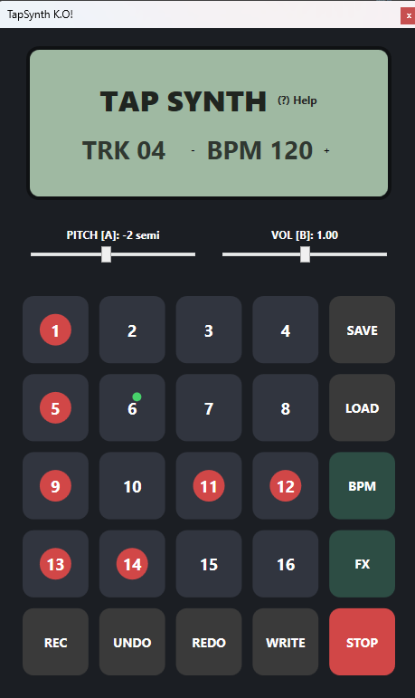

# draft

this is a coding playground project!!

# tapsynth
A playful, lightweight sample‑audio‑synth inspired by the PO‑33 workflow. Record, slice, sequence and tweak sounds with a fun, minimal interface. Keyboard‑first controls, punch‑in FX, lo‑fi modes, per‑step automation and a clean C# engine for fast creative beatmaking.

## feature ideas

* run multiple instances of the app and sync/chain them (FX)?
* use one for drums and one for melody

* record mode for slots 1-16 "cachedsounds"
